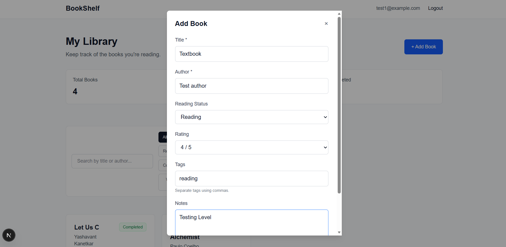
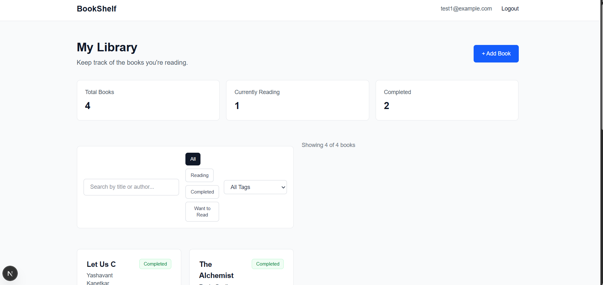

# Personal Book Manager

A full-stack personal book management application built with Next.js, MongoDB, and JWT authentication.

Users can create an account, securely manage their personal book collection, track reading status, rate books, organize them with tags, and quickly search or filter their library.

## Live Demo
## Screenshots

### Login


### Add Book




### Dashboard




**Live Application:** https://personal-book-manager-sage.vercel.app/

## Features

- User signup and login
- JWT-based authentication
- Protected dashboard
- User-specific book collections
- Add new books
- View saved books
- Edit book information
- Delete books
- Track reading status
- Rate books from 1–5
- Add custom tags
- Add personal notes
- Search by book title or author
- Filter by reading status
- Filter by tags
- Responsive interface
- Persistent MongoDB storage

## Reading Status

Books can be organized into three reading states:

- Want to Read
- Reading
- Completed

## Tech Stack

### Frontend

- Next.js
- React
- TypeScript
- Tailwind CSS

### Backend

- Next.js Route Handlers
- MongoDB
- Mongoose
- JWT Authentication

### Deployment

- Vercel
- MongoDB Atlas

## Application Flow

```text
User
 │
 ├── Sign Up
 │
 └── Login
      │
      ▼
 Protected Dashboard
      │
      ├── Add Book
      ├── View Books
      ├── Edit Book
      ├── Delete Book
      ├── Search Books
      └── Filter Books
             │
             ▼
         MongoDB Atlas
```

## Security

The application implements user-specific data access.

Each book is associated with the authenticated user's ID. Book update and delete operations verify both the book ID and the authenticated user ID before modifying data.

Authentication tokens are stored using HTTP-only cookies.

Sensitive configuration such as the MongoDB connection string and JWT secret is stored in environment variables and is not committed to the repository.

## API Routes

| Method | Endpoint | Description |
|---|---|---|
| POST | `/api/auth/signup` | Create an account |
| POST | `/api/auth/login` | Authenticate user |
| POST | `/api/auth/logout` | End user session |
| POST | `/api/books` | Add a book |
| PUT | `/api/books/[id]` | Update a book |
| DELETE | `/api/books/[id]` | Delete a book |

## Project Structure

```text
src/
├── app/
│   ├── api/
│   │   ├── auth/
│   │   └── books/
│   ├── dashboard/
│   ├── login/
│   ├── signup/
│   └── page.tsx
│
├── components/
│   ├── AddBookButton.tsx
│   ├── AddBookForm.tsx
│   ├── BookLibrary.tsx
│   ├── DeleteBookButton.tsx
│   ├── EditBookButton.tsx
│   ├── EditBookForm.tsx
│   └── LogoutButton.tsx
│
├── lib/
│   ├── auth.ts
│   └── mongodb.ts
│
└── models/
    ├── Book.ts
    └── User.ts
```

## Getting Started

### 1. Clone the repository

```bash
git clone https://github.com/purvesh-byte/personal_book_manager.git
cd personal-book-manager
```

### 2. Install dependencies

```bash
npm install
```

### 3. Configure environment variables

Create a `.env.local` file in the project root:

```env
MONGODB_URI=your_mongodb_connection_string
JWT_SECRET=your_secure_jwt_secret
```

Do not commit this file.

### 4. Start the development server

```bash
npm run dev
```

Open:

```text
http://localhost:3000
```

## Production Build

To verify the production build locally:

```bash
npm run build
```

Then:

```bash
npm start
```

## Data Isolation

Books are queried using the authenticated user's ID:

```ts
Book.find({
  userId: user.userId,
});
```

Update and delete operations also include the user's ID in the database query, preventing one authenticated user from modifying another user's books.

## Deployment

The application is deployed on Vercel with MongoDB Atlas as the production database.

Production secrets are configured using Vercel environment variables.

## Future Improvements

- Book cover support
- Pagination
- Sorting
- Reading progress tracking
- Google Books API integration
- Improved accessibility
- Automated tests

## Author

**Purvesh Kadam**

Computer Engineering
